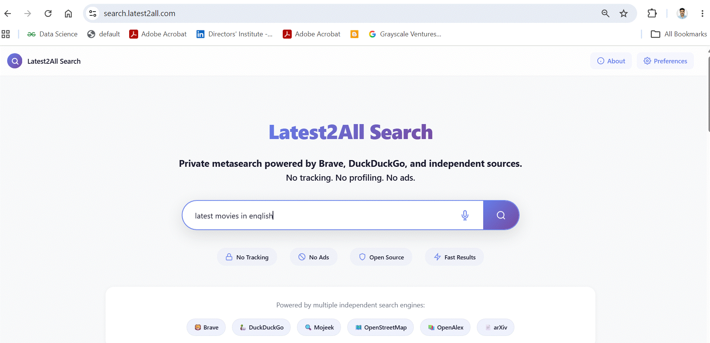
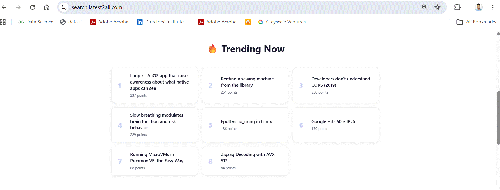
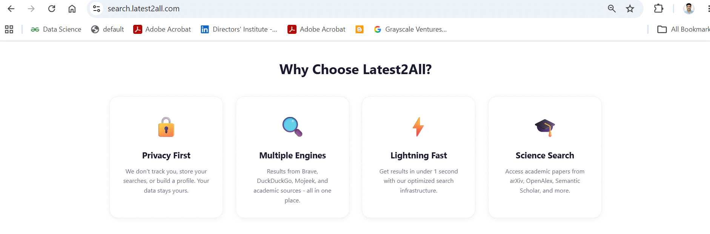
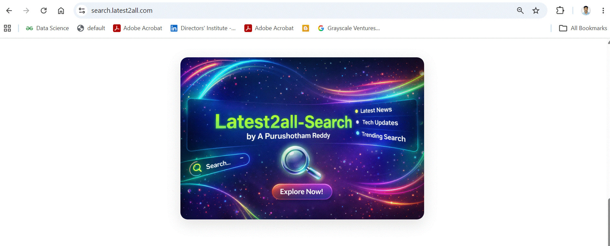
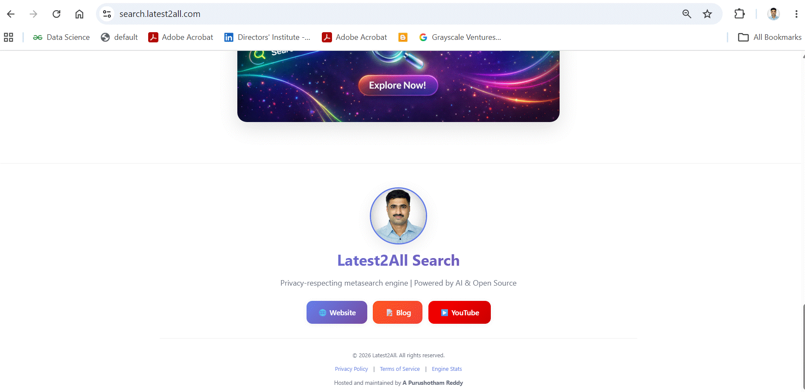
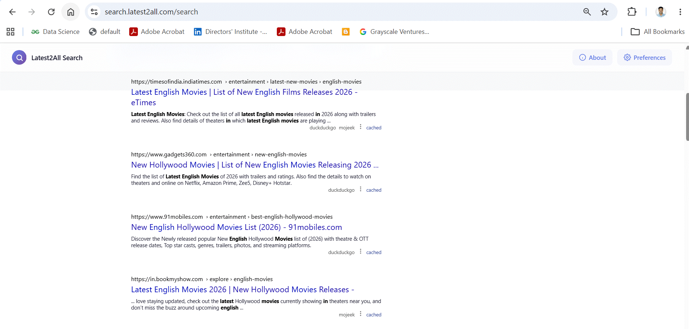
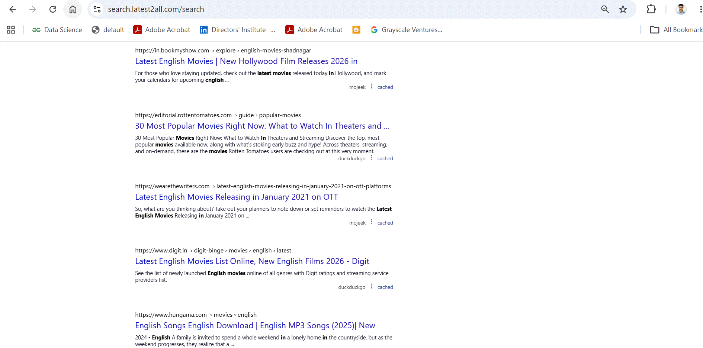
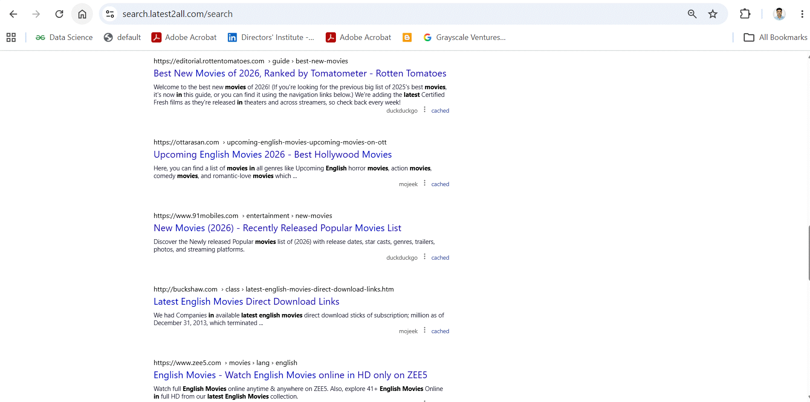
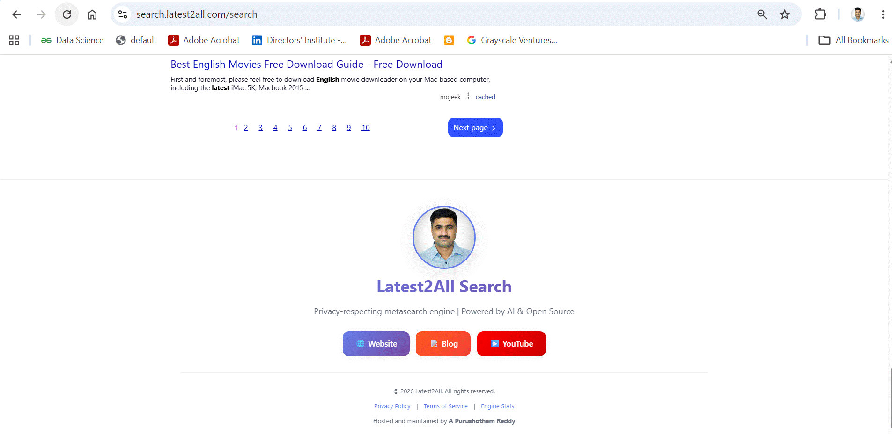
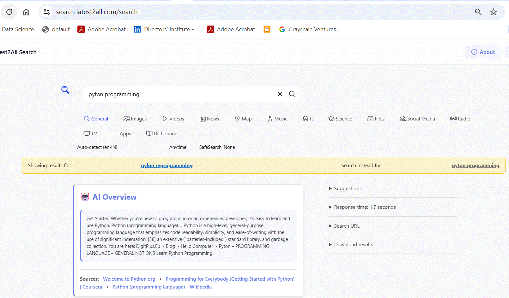

# SearXNG Custom Features

This is an enhanced fork of [SearXNG](https://github.com/searxng/searxng) with additional AI-powered features, spell correction, and analytics.

## Custom Features

### AI Overview (LexRank Summarization)
- **File:** `searx/ai_overview.py`
- **Description:** Extractive summarization of search results using sumy's LexRank algorithm
- **Endpoint:** `/api/overview` (POST)
- **Dependencies:** `sumy`, `symspellpy`, `nltk`
- **Frontend:** `searx/static/simple/overview-async.js`, `overview.css`
- **Display:** Prominent box at the top of search results with source links

### Spell Checker and Correction
- **Files:** `searx/spell_checker.py`, `searx/spelling_api.py`
- **Description:** Real-time spelling correction using SymSpell algorithm
- **Endpoint:** `/api/spelling` (POST)
- **Data Required:** `spell_models/frequency_dictionary_en_82_765.txt` (download separately)
- **Features:**
  - Real-time query correction
  - "Did you mean?" suggestions
  - Custom dictionary support

### Search Statistics Collector
- **File:** `searx/stats_collector.py`
- **Description:** Tracks search queries and engine usage via Redis
- **Storage:** Redis keys `searxng:total_searches`, `searxng:engine:*`
- **Dashboard:** Accessible at `/stats` with bar charts and engine statistics
- **API:** `/stats-api` endpoint for frontend consumption

### User Agent Rotator Plugin
- **File:** `searx/plugins/useragent_rotator.py`
- **Description:** Rotates user agents for enhanced privacy
- **Type:** SearXNG plugin (can be enabled/disabled in preferences)

### Trending Topics Fetcher
- **File:** `trending_fetcher.py`
- **Description:** Fetches trending topics for homepage display
- **Output:** `searx/static/themes/simple/img/trending.json`

### Custom UI Enhancements
- **Files:** `searx/static/simple/overview.css`, custom images in `searx/static/themes/simple/img/custom/`
- **Features:**
  - Modern gradient design (purple theme)
  - Responsive layout
  - Dark mode support
  - Custom branding for Latest2All Search

## Technical Architecture

### Modified Files
- `searx/webapp.py` - Added `/api/overview`, `/api/spelling`, `/stats-api` endpoints
- `searx/templates/simple/stats.html` - Custom stats dashboard
- `searx/static/simple/overview-async.js` - Frontend AI overview loader

### New Endpoints

| Endpoint | Method | Description |
|----------|--------|-------------|
| `/api/overview` | POST | Generate AI summary from search results |
| `/api/spelling` | POST | Spell correction for queries |
| `/stats-api` | GET | Fetch search statistics (JSON) |

## Required Data Files (Not Included)

These large files must be downloaded separately:

    # Spell checker dictionary
    mkdir -p spell_models/
    wget -O spell_models/frequency_dictionary_en_82_765.txt \
      "https://raw.githubusercontent.com/wolfgarbe/SymSpell/master/SymSpell/frequency_dictionary_en_82_765.txt"

    # Symspell bigrams (optional, for phrase correction)
    wget -O spell_models/frequency_bigramdictionary_en_243_342.txt \
      "https://raw.githubusercontent.com/wolfgarbe/SymSpell/master/SymSpell/frequency_bigramdictionary_en_243_342.txt"

    # NLTK data (for LexRank summarization)
    python3 -c "import nltk; nltk.download('punkt'); nltk.download('stopwords')"

## Installation

    # Clone the repository
    git clone https://github.com/purushothamlatest2all-gif/searxng-custom.git
    cd searxng-custom

    # Install Python dependencies
    pip install -r requirements.txt
    pip install sumy symspellpy nltk redis

    # Download required data files (see above)

    # Configure settings
    cp searx/settings.yml.example searx/settings.yml
    # Edit searx/settings.yml with your:
    #   - secret_key (change this!)
    #   - API keys for engines
    #   - Redis connection (for stats)

    # Run SearXNG
    python -m searx.webapp

## File Structure

    searx/
    +-- ai_overview.py              # AI Overview backend (LexRank)
    +-- spell_checker.py            # SymSpell spell checker
    +-- spelling_api.py             # Spelling API route
    +-- stats_collector.py          # Redis-based stats collector
    +-- overview_worker.py          # Overview worker process
    +-- plugins/
    |   +-- overview.py             # Overview plugin
    |   +-- useragent_rotator.py    # UA rotator plugin
    +-- static/simple/
    |   +-- overview-async.js       # Overview frontend loader
    |   +-- overview.css            # Overview styles
    +-- templates/simple/
        +-- stats.html              # Custom stats dashboard

    trending_fetcher.py             # Trending topics script
    CUSTOM_FEATURES.md              # This file

## Configuration

Copy the example settings:

    cp searx/settings.yml.example searx/settings.yml

Then customize `searx/settings.yml` with your:
- `secret_key` (change this to a random string!)
- API keys for search engines (if needed)
- Redis connection (for statistics)
- Server binding settings

## License

This fork inherits SearXNG's **AGPL-3.0** license. All modifications are open source and must remain so when distributed or run as a network service.

## Acknowledgments

- [SearXNG](https://github.com/searxng/searxng) - Original privacy-respecting metasearch engine
- [SymSpell](https://github.com/wolfgarbe/SymSpell) - Spell checking algorithm
- [sumy](https://github.com/miso-belica/sumy) - LexRank summarization
- [NLTK](https://www.nltk.org/) - Natural language processing

## Reporting Issues

Please use GitHub Issues to report bugs or request features.

## Contributing

Contributions are welcome! Please:
1. Fork the repository
2. Create a feature branch
3. Submit a pull request with clear description

---

**Live Demo:** https://search.latest2all.com

## 📸 Screenshots & Demos

### Home Page

| Screenshot | Description |
|------------|-------------|
|  | Modern search interface with custom branding |
|  | Category filters and search options |
|  | Voice search and autocomplete features |
|  | Responsive design on different viewports |
|  | Custom UI with gradient theme |

### Search Results & AI Features

| Screenshot | Description |
|------------|-------------|
|  | Search results with engine indicators |
|  | Pagination and result navigation |
|  | Result metadata and source tracking |
|  | Filter and sort options |
|  | Mobile-responsive results view |
|  | **AI Overview** - LexRank-powered summarization at the top of results |
|  | **AI Overview with Spell Check** - Combined AI summary and real-time spell correction |

### 🎥 Live Demo

Try it yourself: **https://search.latest2all.com**

## 🌐 Public Instance Deployment

This fork is configured to run as a **public SearXNG instance** with:

- ✅ **Privacy-focused**: No query logging, only aggregate statistics
- ✅ **Rate limiting**: Protection against abuse and DDoS
- ✅ **HTTPS**: Secure connections by default
- ✅ **Privacy Policy**: Clear disclosure of data handling
- ✅ **Bot protection**: Built-in bot detection
- ✅ **AGPL-3.0 compliant**: All modifications are open source

### Deployment Checklist

To deploy as a public instance:

1. Copy `settings.yml.example` to `settings.yml`
2. Change the `secret_key` to a random string
3. Set `server.limiter: true` (already default)
4. Set `server.public_instance: true` (already default)
5. Add your privacy policy to `searx/infopage/en/privacy-policy.rst`
6. Configure HTTPS with Let's Encrypt
7. Set up reverse proxy (Apache/Nginx)

### Live Public Instance

**Demo:** https://search.latest2all.com

This instance is listed on the [SearXNG public instances](https://searx.space/) and meets all community requirements.
