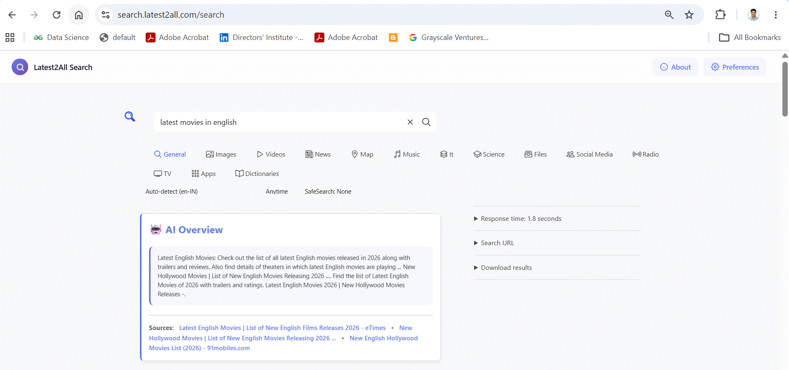

# SearXNG Custom - Enhanced Privacy-Respecting Search

## 🤖 AI Overview Feature

An enhanced fork of [SearXNG](https://github.com/searxng/searxng) with AI-powered search summaries, spell correction, and analytics.

## ✨ Key Features

- 🤖 **AI Overview** - LexRank-powered extractive summarization
- 🔤 **Spell Checker** - SymSpell real-time correction
- 📊 **Statistics** - Redis-based search analytics
- 👤 **Privacy** - User agent rotation
- 🎨 **Modern UI** - Custom gradient design

📖 See [CUSTOM_FEATURES.md](CUSTOM_FEATURES.md) for full documentation.

## 📜 License

AGPL-3.0 (same as original SearXNG)
